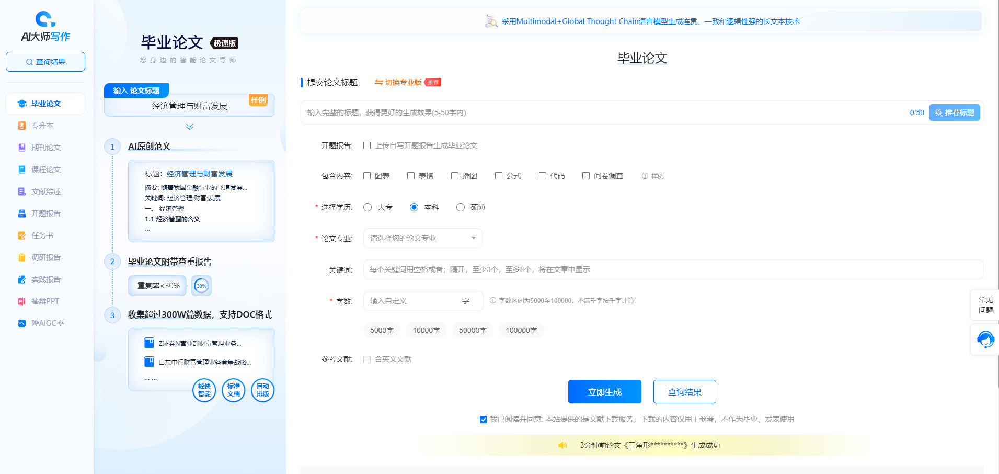
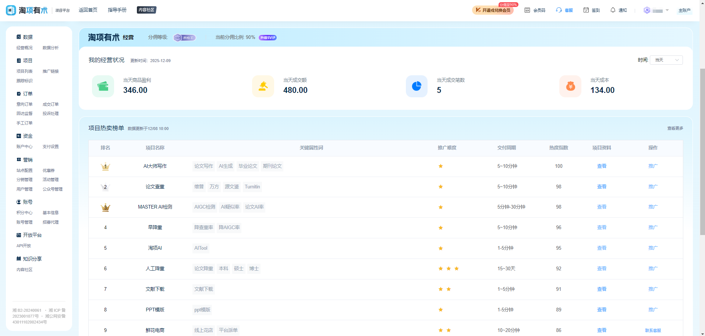

## 🧰 最强AI论文写作助手
ai论文一键生成，毕业论文、专升本论文、课程论文、期刊论文、开题报告、任务书、调研报告、实践报告、答辩ppt、AIGC降重...

🎓 全网已部署百套

🕹️ 五分钟即可开始运营
* 无需编程，无需设计
* 无需购买服务器，无需配置环境
* 0元部署
* 提供数据管理后台

## 📝 在线体验地址

* C端(客户端): https://jym.dashixiezuo.com

* B端(管理端): https://admins.taoxiangyoushu.com/#/register?code=e87IbsW8

## C端功能特性
* 🚀一键生成结构完善、内容专业高质量的论文文件
* 🔥支持降AIGC率, 维,万,知等AI率检测30%以下
* 🔥查重率低, 维,万,知等查重率检测20%以下
* 支持自定义参考文献
* 支持英文参考文献数量设定
* 🔥支持三级提纲, 提供AI生成提纲, 自写提纲, 编辑提纲
* 支持超长文输出, 上下文连贯, 一次性生成十万字
* 支持自定义投喂内容, 投喂开题报告
* 🔥支持图表,表格,插图,公式,代码,问卷调查自选插入
* 支持用户勾选增值服务(如:开题报告,任务书,降AI,答辩ppt,实证数据)
* 真实参考文献, 内容自动引用标注
* 🔥支持匿名,无需登录
* 🔥支持PC端,移动端
* 支持API调用和定制
* 支持二级分销, 活动营销等玩法
* 🔥支持微信、支付宝、小红书等支付方式
* 提供C端源码, 可二次开发

## B端功能特性
* 🚀提供数据管理后台其中主账号1个,子账号5个(每个子账号数据独立, 享有主账号所有功能和权限,相当于以下所有功能配置×6)
* 支持用户注册, 登录, 个人信息维护
* 🔥支持订单管理, 订单支付, 订单退款
* 🔥支持数据统计, 分析, 报表等功能
* 🔥支持一键配置专属域名(免费)
* 支持绑定自有域名(CNAME解析)
* 支持配置客服信息(如:客服微信,客服邮箱,客服电话)
* 支持设置跟踪链接(统计流量来源与转化)
* 支持自定义调整销售价(固定计费或阶梯计费)
* 支持自定义产品增值服务启用状态和默认勾选
* 支持在打包文件中插入自定义文件(如插入查重链接文档)
* 支持数据分享(如分享给二级代理销售数据)
* 🔥支持平台收款(如:微信支付,支付宝支付)或绑定自有支付账号(利润直接到账)
* 平台代收利润随时可提现, 资金秒到账
* 🔥支持查看意向订单,成交订单,订单详情(包括用户信息, 订单金额, 订单状态, 订单时间, 来源, 域名, 提交信息,订单日志等)
* 支持手工提交查重降重订单(checkPass每日免费十次)
* 🔥支持配置微信支付, 支付宝支付, 小红书支付, 淘宝支付
* 🔥支持优惠券生成(免费券,折扣券,满减券,直减券), 自定义可复用次数、发放量、有效期
* 提供分销功能(如:二级分销)
* 🔥提供活动管理,活动配置(分享到指定渠道后, 获取指定奖励)
* 支持公众号配置(如活动关注公众号自动发优惠券)
* 拥有用户等级, 积分系统
* 支持配置360oCPC、百度oCPC
* 🔥支持配置网站名称、关键词、描述、百度统计代码(seo优化)
* 🔥支持主题设置、logo设置、icon设置
* 🔥支持报告logo设置, 自定义报告ico
* 提供API接口文档, 方便开发者调用,
* 提供前端源码二次开发部署
* 🔔其他功能可自行探索

## 系统特性
💥💥💥支持OEM一键免费部署

* 拥有自有品牌

* 支持个性化样式定制

* 灵活使用SAAS系统

* 灵活的价格体系

* 多级分销体系

* 支持二级代理

* 支持电商渠道激活码/核销码/渠道码

* 一站式运维让你专注运营推广

## 多端支持
* PC主流论文写作方式
* 移动端论文写作方式

## API接口支持
* 支持大纲一键生成
* 支持论文一键生成
* 支持接口回调通知
* ... ...

## 📢OEM加盟 / 合伙人招商创业
* 支持合伙人，招商创业加盟
* 支持分销
* 报表明细一目了然
* 用户注册、使用日志报表

## 🤝联系我们(请在微信备注: 合作合伙人)
* 微信: kelelw520

